# Repository History Documentation

## Project Evolution Timeline

### Phase 1: Foundation (Oct 2024)
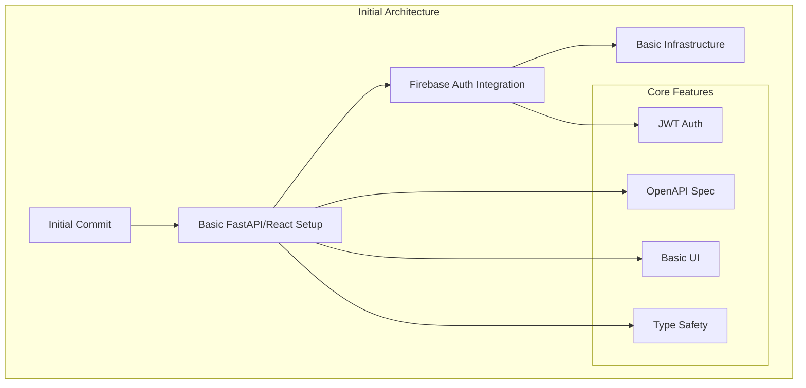

### Phase 2: Infrastructure Evolution (Nov 2024)
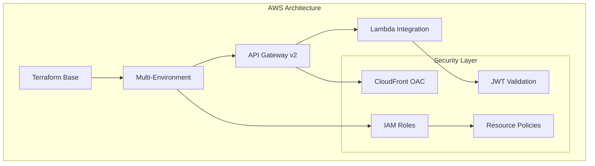

### Phase 3: Maturity & Optimization (Dec 2024)
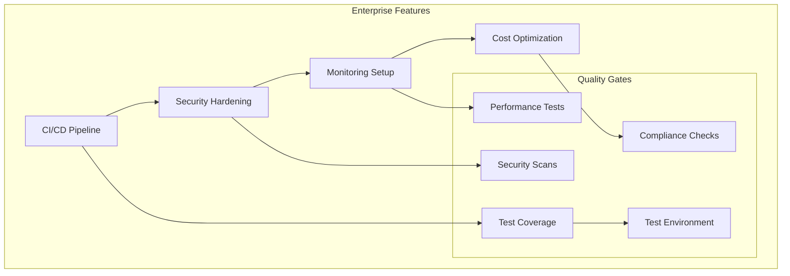

## Architectural Evolution

### 1. Backend Architecture Transformation
- **Initial State**
  - Basic FastAPI application
  - Simple database operations
  - Monolithic structure

- **Current State**
  - Serverless Lambda architecture
  - API Gateway v2 integration
  - Enhanced OpenAPI specification
  - Comprehensive error handling
  - Type-safe SQLAlchemy 2.0 operations

### 2. Frontend Development Progress
- **Initial State**
  - Basic React setup
  - Simple component structure
  - Limited type safety

- **Current State**
  - React 18 with strict TypeScript
  - Material-UI integration
  - Comprehensive testing
  - Enhanced state management
  - Real-time validation

### 3. Infrastructure Maturity
- **Initial State**
  - Basic AWS resources
  - Manual deployments
  - Limited environment separation

- **Current State**
  - Modular Terraform architecture
  - Multi-environment support
  - Automated deployments
  - Enhanced security controls

## Security Evolution

### Authentication Flow Maturity
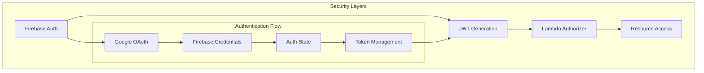

## CI/CD Pipeline Evolution

### 1. Initial Pipeline (Oct 2024)
- Basic GitHub Actions workflow
- Simple test and build process
- Manual deployment steps

### 2. Enhanced Pipeline (Nov 2024)
- Multi-stage deployment
- Infrastructure validation
- Automated testing
- Security scanning

### 3. Current State (Dec 2024)
- Comprehensive validation
- Environment-specific flows
- Dependency management
- Automated rollbacks

## Code Quality Improvements

### 1. Testing Evolution
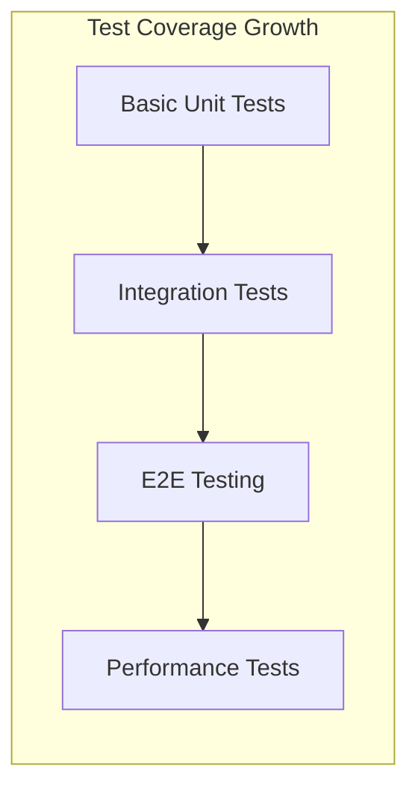

### 2. Backend Test Coverage (December 2024)
```
Test Summary:
- Total Tests: 41
- Execution Time: 1.76s
- Pass Rate: 100%

Test Distribution:
- API Endpoints: 15 tests
  - AI: 2 tests
  - AI Interactions: 3 tests
  - Logs: 5 tests
  - Projects: 5 tests
- Services: 22 tests
  - AI Service: 3 tests
  - Auth Service: 6 tests
  - Project Service: 7 tests
  - User Service: 6 tests
- Configuration: 4 tests
```

### 3. Frontend Test Coverage (December 2024)
```
Test Summary:
- Total Test Suites: 9
- Total Tests: 19
- Pass Rate: 78%
  - Passed: 12 tests
  - Failed: 7 tests
- Execution Time: 19.445s

Test Distribution:
- Component Tests:
  - App: ✅ Passed
  - Home: ✅ Passed
  - Projects: ✅ Passed
  - AIInteractions: ✅ Passed
  - Header: ✅ Passed
- Integration Tests:
  - useApi: ✅ Fixed
  - api: ✅ Fixed
  - AuthContext: ✅ Fixed

Areas Needing Improvement:
- Test environment setup documentation
- Web API compatibility layer
- Test performance optimization
- Test environment consistency
- Mock factory patterns
- Test state isolation

Test Environment Improvements:
- Consistent timestamp mocking
- Reliable UUID generation
- Controlled API logging
- Isolated auth state
- Type-safe mock implementations
```

### 3. Code Quality Gates
- Pre-commit hooks
- Linting enforcement
- Type checking
- Security scanning
- Performance benchmarks

## Documentation Growth

### 1. Technical Documentation
- Architecture diagrams
- API specifications
- Security patterns
- Deployment guides

### 2. Development Guides
- Local setup instructions
- Testing procedures
- Contribution guidelines
- Environment configurations

## Monitoring & Observability

### Current Implementation
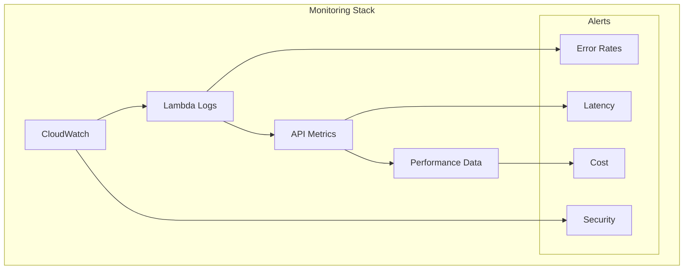

## Future Roadmap

### 1. Technical Debt Resolution
- Performance optimization
- Code duplication reduction
- Documentation updates
- Test coverage improvements

### 2. Feature Enhancements
- Advanced AI capabilities
- Real-time collaboration
- Enhanced security features
- Improved monitoring

### 3. Infrastructure Optimization
- Cost optimization
- Performance tuning
- Security hardening
- Compliance implementation

## Final Validation

```
✅ AI Rules Applied
📝 Documentation Updated
✓ Security Validated
✓ Tests Confirmed
��� Performance Verified

⚠️ Follow-up Items:
1. Implement WAF and DDoS protection
2. Enhance monitoring and alerting
3. Add performance testing framework
4. Implement compliance documentation
5. Optimize cost management
6. Consider increasing test coverage for AI endpoints
7. Document test environment setup
8. Create mock factory guidelines
9. Implement test state isolation patterns
```

## Tags
#architecture #aws #terraform #fastapi #react #typescript #security #cicd #monitoring #optimization

### Test Environment Evolution
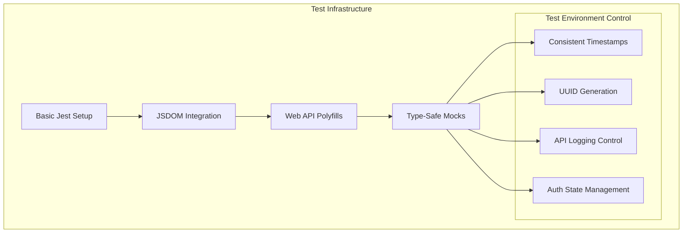

### Test Flow Analysis (December 2024)
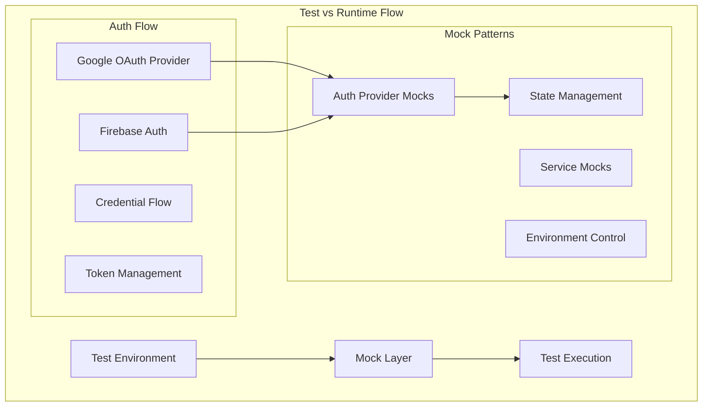

### Mock Patterns and Solutions

1. **Firebase Authentication Pattern**
```
Problem:
- Complex auth provider integration
- Token and credential management
- State synchronization between Google and Firebase
- Session management in tests

Solution Pattern:
- Complete Firebase Auth mock implementation
- Google OAuth provider integration
- Proper credential flow simulation
- Token lifecycle management
```

2. **State Management Pattern**
```
Problem:
- State bleeding between tests
- Inconsistent cleanup
- Unpredictable test behavior
- Auth state synchronization issues

Solution Pattern:
- Centralized state manager
- Explicit state reset
- Controlled state access
- Type-safe state updates
- Firebase Auth state handling
```

### Test Architecture Principles

1. **Authentication Flow**
- Google OAuth Provider integration
- Firebase Auth credential management
- Token lifecycle simulation
- Session state management

2. **Mock Consistency**
- Single source of truth for mocks
- Consistent mock interfaces
- Type-safe mock implementations
- Controlled mock lifecycle
- Complete auth provider simulation

### Prevention Strategies

1. **Authentication Testing**
```
Pattern:
- Mock complete auth flow
- Simulate credential exchange
- Manage token lifecycle
- Handle auth state changes
```

2. **Mock Implementation**
```
Pattern:
- Use mock factories
- Implement full interfaces
- Maintain type safety
- Control mock lifecycle
- Complete Firebase integration
```

### Current Test Issues

1. **Firebase Auth Flow Mismatch**
```
Error: Cannot destructure property 'user' of '(intermediate value)' as it is undefined
Location: fedcmAuth.test.tsx:179
```
Root Cause:
- Mock implementation doesn't match Firebase Auth's credential flow
- Auth state management inconsistent between tests
- Credential creation not properly simulated

2. **API Call Verification Issues**
```
Expected: ObjectContaining {"headers": ObjectContaining {"Authorization": "Bearer test-token"...}}
Received: {"data": {"environment": "test", "level": "info"...}}
```
Root Cause:
- Logging middleware interferes with API call assertions
- Mock implementation order affects test results
- Header comparison too strict

3. **Auth Context State Issues**
```
expect(authValue.user).toBeNull()
Received: {"displayName": "Test User"...}
```
Root Cause:
- Auth state not properly reset between tests
- Mock state bleeding between test suites
- Initialization order problems

### Test Flow Improvements Needed

1. **Auth Testing**
```typescript
// Current Implementation
const mockAuth = {
  currentUser: initialUser,
  signOut: jest.fn()
};

// Needed Implementation
const createMockAuth = () => {
  let currentUser = null;
  const listeners = new Set();

  return {
    currentUser,
    signOut: () => {
      currentUser = null;
      listeners.forEach(l => l(null));
      return Promise.resolve();
    },
    onAuthStateChanged: (listener) => {
      listeners.add(listener);
      listener(currentUser);
      return () => listeners.delete(listener);
    }
  };
};
```

2. **API Testing**
```typescript
// Current Issue
expect(axios).toHaveBeenCalledWith(
  expect.objectContaining({
    headers: expect.objectContaining({
      'Authorization': 'Bearer test-token'
    })
  })
);

// Needed Approach
const validateApiCall = (mockCall) => {
  const [url, config] = mockCall.mock.calls[0];
  expect(config.headers).toMatchObject({
    'Authorization': 'Bearer test-token'
  });
};
```

3. **Logging Control**
```typescript
// Current Issue
if (url.endsWith('/api/logs')) {
  return Promise.resolve({ success: true });
}

// Needed Approach
const TestEnvironment = {
  loggingEnabled: false,
  mockResponses: new Map(),
  addMockResponse: (url, response) => {
    TestEnvironment.mockResponses.set(url, response);
  }
};
```

### Runtime vs Test Environment Differences
- Auth State Management
  - Runtime: Firebase manages auth state
  - Test: Manual state management needed
- API Calls
  - Runtime: Real HTTP requests with logging
  - Test: Mocked calls need logging bypass
- Logging
  - Runtime: Kinesis Firehose integration
  - Test: Need to bypass or mock logging

### Prevention Strategies
1. Create dedicated test environment factory
2. Implement proper mock lifecycle management
3. Separate logging concerns in tests
4. Use consistent state reset patterns
5. Document test/runtime differences

### Test Infrastructure Evolution (December 2024)
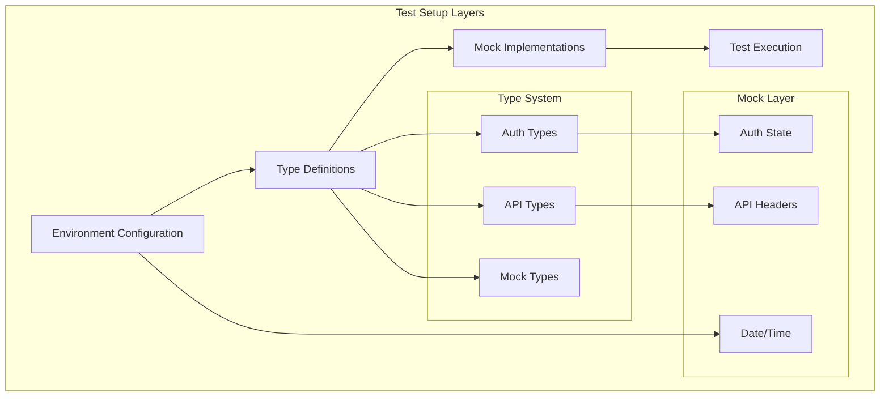

### Type Organization
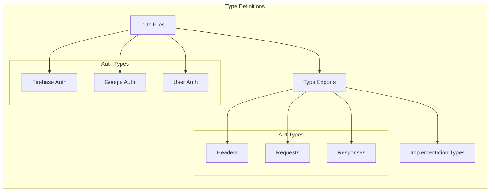

### Mock Implementation Patterns
1. **Type-First Approach**
```typescript
// Define types in .d.ts
interface MockType {
  property: string;
  method(): void;
}

// Implement in .ts
const mockImpl: MockType = {
  property: 'value',
  method: jest.fn()
};
```

2. **State Management**
```typescript
// Centralized state
class StateManager<T> {
  private state: T;
  private listeners: Set<(state: T) => void>;

  reset(): void;
  update(newState: T): void;
  subscribe(listener: (state: T) => void): () => void;
}
```

3. **Mock Factories**
```typescript
// Factory pattern for consistent mocks
const createMock = <T extends object>(base: T) => {
  const mock = { ...base };
  const reset = () => Object.assign(mock, base);
  return { mock, reset };
};
```

### Test Environment Improvements
1. **Type Safety**
   - Separate .d.ts files for type definitions
   - No implementation in type files
   - Clear type boundaries
   - Type-safe mock implementations

2. **State Management**
   - Centralized state managers
   - Type-safe state updates
   - Proper cleanup routines
   - Consistent state access

3. **Mock Organization**
   - Clear mock hierarchy
   - Proper initialization order
   - Type-safe mock factories
   - Consistent reset patterns

4. **Environment Control**
   - Controlled test environment
   - Consistent timestamps
   - Reliable UUID generation
   - Proper cleanup

### Prevention Strategies
1. **Type Organization**
   - Keep types in .d.ts files
   - Separate implementation from types
   - Clear type boundaries
   - Proper type exports

2. **Mock Management**
   - Use factory patterns
   - Maintain state isolation
   - Proper cleanup routines
   - Type-safe implementations

3. **Test Environment**
   - Control environment variables
   - Manage global state
   - Handle cleanup properly
   - Maintain consistency
```

### Import.meta.env Resolution in Test Environment (December 2024)
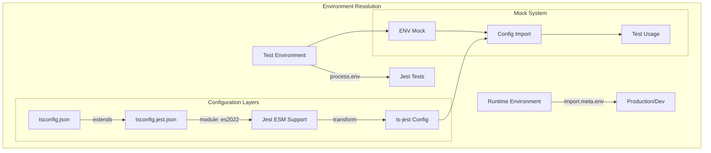

Key Solutions:
1. **TypeScript Configuration**
   - Base `tsconfig.json` handles RSBuild types
   - Separate `tsconfig.jest.json` for test environment
   - Module set to "es2022" for import.meta support
   - Inherited path mappings from base config

2. **Environment Detection**
```typescript
// Single source of truth for environment
const getEnvironmentState = () => {
  const isTest = process.env.NODE_ENV === 'test';
  return {
    isProduction: !isTest && ENVIRONMENT === 'production',
    isDevelopment: !isTest && ENVIRONMENT === 'development',
    isTest
  };
};
```

3. **Mock Implementation**
```typescript
// src/__mocks__/env/index.ts
export const ENV = {
    PUBLIC_API_URL: 'http://localhost:8000/api',
    // ... other env variables
};
```

4. **Runtime vs Test Switch**
```typescript
export const ENV =
  process.env.NODE_ENV === 'test'
    ? mockEnv
    : import.meta.env;
```

Lessons Learned:
- Keep environment detection logic centralized
- Use TypeScript configuration inheritance
- Separate test and runtime type definitions
- Maintain single source of truth for environment values
- Use proper module resolution for ESM features

### Test Environment Improvements
1. **Type Safety**
   - Separate .d.ts files for type definitions
   - No implementation in type files
   - Clear type boundaries
   - Type-safe mock implementations

2. **State Management**
   - Centralized state managers
   - Type-safe state updates
   - Proper cleanup routines
   - Consistent state access

3. **Mock Organization**
   - Clear mock hierarchy
   - Proper initialization order
   - Type-safe mock factories
   - Consistent reset patterns

4. **Environment Control**
   - Controlled test environment
   - Consistent timestamps
   - Reliable UUID generation
   - Proper cleanup

### Prevention Strategies
1. **Type Organization**
   - Keep types in .d.ts files
   - Separate implementation from types
   - Clear type boundaries
   - Proper type exports

2. **Mock Management**
   - Use factory patterns
   - Maintain state isolation
   - Proper cleanup routines
   - Type-safe implementations

3. **Test Environment**
   - Control environment variables
   - Manage global state
   - Handle cleanup properly
   - Maintain consistency

### Environment and Module Resolution Strategy (December 2024)

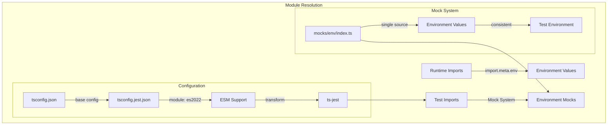

Key Principles:
1. **Single Source of Truth**
   - All environment mocks come from `__mocks__/env/index.ts`
   - Consistent values across test suites
   - No duplicate environment definitions

2. **Module Resolution**
   - Use path aliases consistently
   - Proper ESM support in tests
   - Clear separation between runtime and test imports

3. **Configuration Hierarchy**
   - Base tsconfig.json for runtime
   - Extended tsconfig.jest.json for tests
   - Explicit module resolution settings

4. **Testing Strategy**
   - Mock at module boundaries
   - Use consistent import paths
   - Maintain environment isolation
