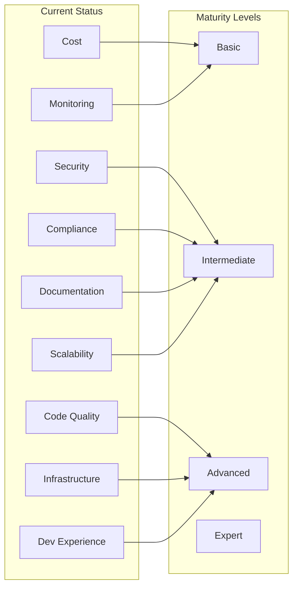

# AI Wizard Codebase Evaluation

## Executive Summary
Comprehensive evaluation of the AI Wizard codebase across key enterprise architecture perspectives.

## Evaluation by Domain

### Code Quality & Architecture
**Level: Intermediate to Advanced**

✅ Strengths:
- Well-structured modular architecture
- Clear separation of concerns (frontend/backend/infrastructure)
- Type safety with TypeScript and SQLAlchemy
- Comprehensive test coverage

⚠️ Improvement Areas:
- API versioning strategy
- Circuit breakers for external services
- More extensive error boundary patterns

### Infrastructure & DevOps
**Level: Advanced**

✅ Strengths:
- Modular Terraform structure
- Multi-environment support
- Proper state management
- Clear dependency flows
- Automated deployments

⚠️ Improvement Areas:
- Disaster recovery procedures
- Blue-green deployment strategy
- Infrastructure drift detection

### Security
**Level: Intermediate to Advanced**

✅ Strengths:
- JWT validation
- Firebase Authentication
- IAM role-based access
- Proper secret management

⚠️ Improvement Areas:
- WAF implementation
- DDoS protection
- Security scanning in CI/CD
- SAST/DAST integration

### Cost Management
**Level: Basic to Intermediate**

✅ Strengths:
- Resource tagging
- Environment separation

⚠️ Improvement Areas:
- Cost allocation tagging
- Budget alerts
- Resource scaling policies
- Cost optimization strategies

### Compliance & Governance
**Level: Basic to Intermediate**

✅ Strengths:
- Infrastructure as Code
- Audit logging
- Environment isolation

⚠️ Improvement Areas:
- Compliance documentation
- Data retention policies
- GDPR/CCPA compliance
- Audit trail improvements

### Documentation
**Level: Intermediate**

✅ Strengths:
- Clear README
- Architecture diagrams
- Deployment documentation
- Local development guides

⚠️ Improvement Areas:
- API documentation
- Security procedures
- Incident response playbooks
- Architecture decision records (ADRs)

### Monitoring & Observability
**Level: Basic to Intermediate**

✅ Strengths:
- CloudWatch integration
- Basic error tracking

⚠️ Improvement Areas:
- APM implementation
- Structured logging
- Metrics dashboards
- SLO/SLA definitions

### Scalability & Performance
**Level: Intermediate**

✅ Strengths:
- CloudFront CDN
- Lambda auto-scaling

⚠️ Improvement Areas:
- Cache strategies
- Performance testing
- Load balancing
- Database optimization

### Development Experience
**Level: Advanced**

✅ Strengths:
- Strong typing
- Local development setup
- CI/CD automation
- Code generation tools

⚠️ Improvement Areas:
- Development containers
- More extensive linting
- Pre-commit hooks

## Maturity Assessment

## Recommendations for Expert Level

### 1. Security & Compliance
- Implement comprehensive security scanning
- Add compliance documentation
- Enhance audit capabilities

### 2. Cost & Performance
- Implement cost optimization strategies
- Add performance monitoring
- Define scaling policies

### 3. Monitoring & Observability
- Implement APM
- Add structured logging
- Create monitoring dashboards

### 4. Documentation & Governance
- Add ADRs
- Create runbooks
- Document security procedures

## Conclusion
The codebase demonstrates a solid foundation with several advanced features, particularly in infrastructure and development experience. Key areas for improvement focus on enterprise-grade enhancements in security, monitoring, and compliance to reach expert level maturity.

## Tags
#evaluation #architecture #security #devops #compliance #monitoring 