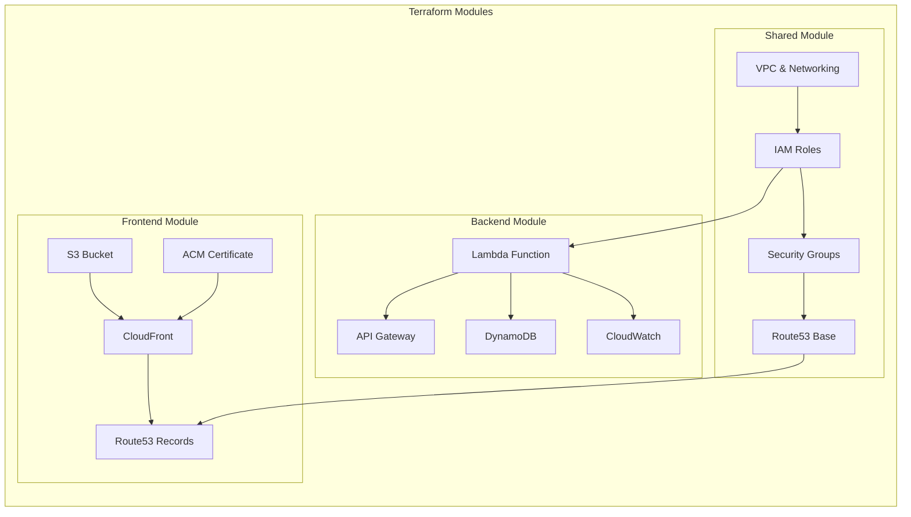
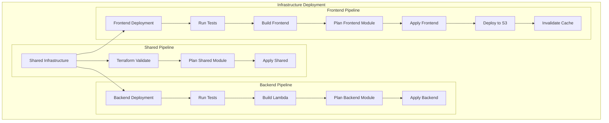
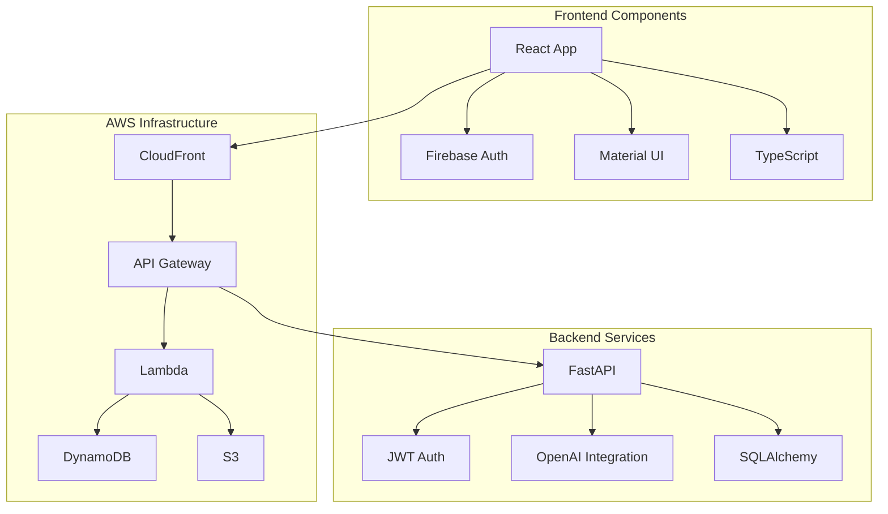
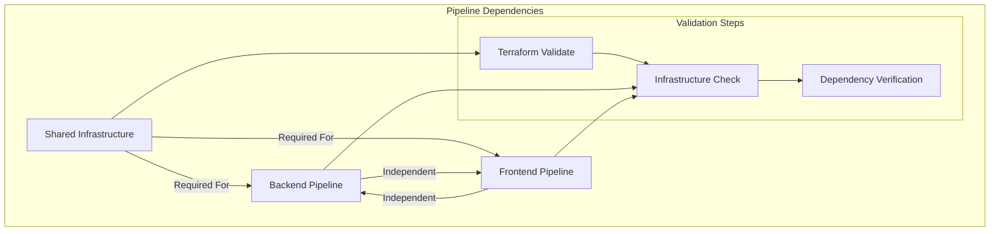
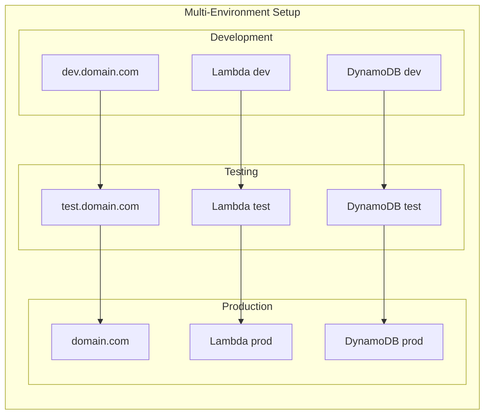
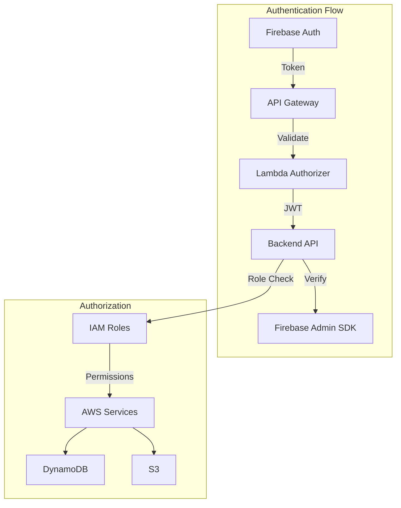

# AI Wizard Codebase Summary

## Architecture Overview

### Infrastructure Modules

### Deployment Pipeline Flow

### Application Architecture

## CI/CD Pipeline Dependencies

## Environment Management

## Security Model

## Key Features

### Backend Capabilities
- Enhanced OpenAPI specification
- Improved JWT validation
- Comprehensive test coverage
- Modular FastAPI structure
- Type-safe database operations
- Proper error handling

### Frontend Features
- Modern React with TypeScript
- Material-UI components
- Real-time validation
- Enhanced state management
- Component testing
- Responsive design

### Infrastructure
- Modular Terraform design
- Multi-environment support
- Proper resource tagging
- Security best practices
- State management in S3
- Automated deployments

## Related Documentation
- [Deployment Strategy](strategies/deployment_strategy.md)
- [Security Patterns](decisions/security_patterns.md)
- [Local Development](development/local_setup.md)

## Tags
#architecture #aws #terraform #fastapi #react #typescript #cicd #security
