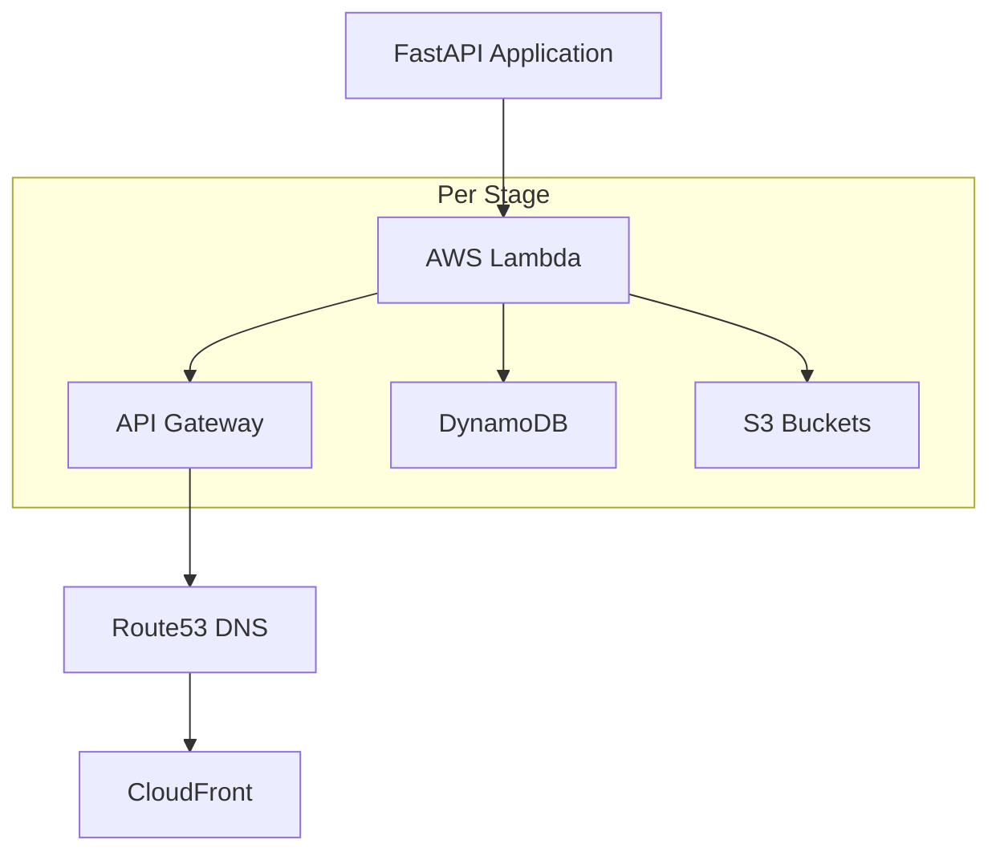
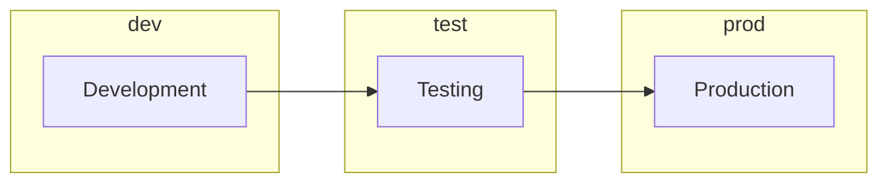
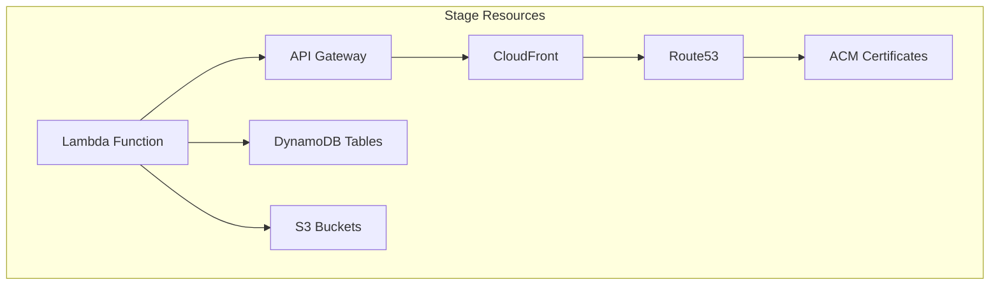
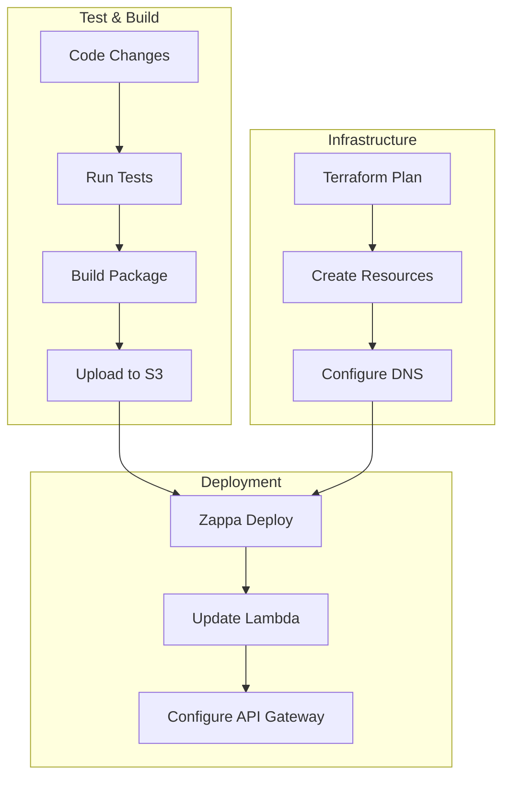
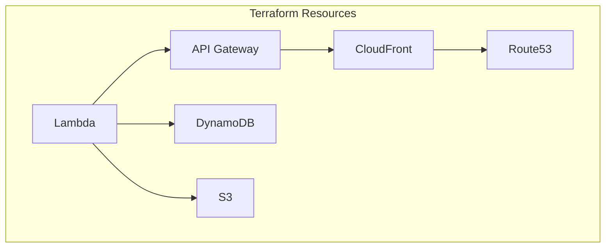
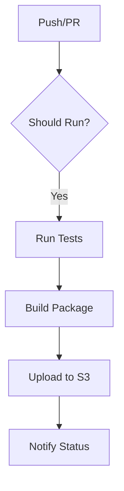
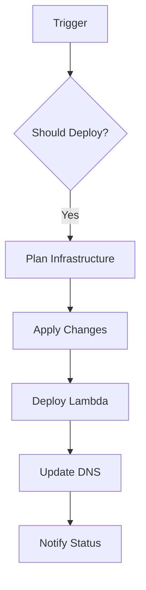
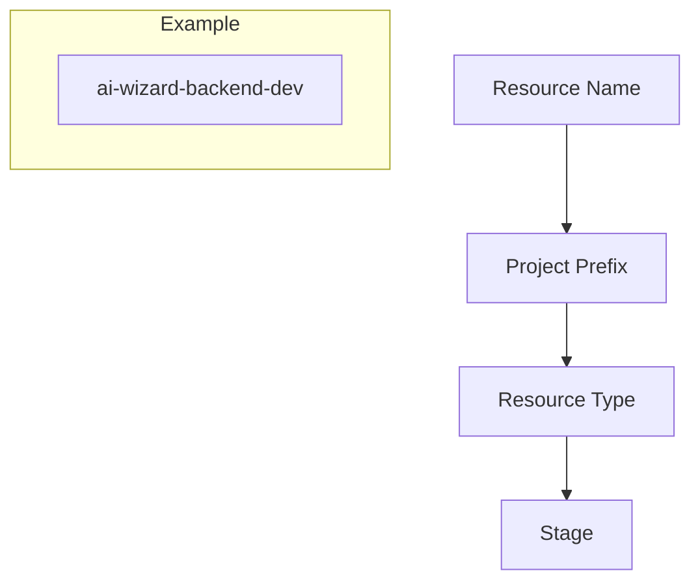
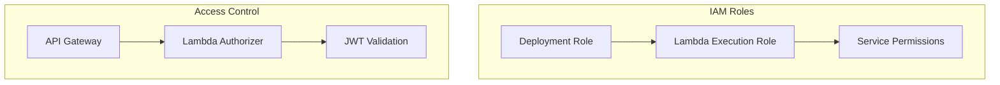
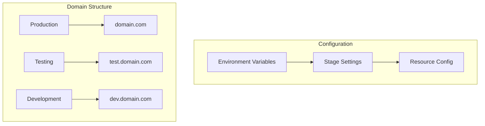

# AI Wizard Codebase Summary

## Architecture Overview

### Backend Structure


### Deployment Architecture
1. **Stages**:


2. **AWS Resources per Stage**:


## CI/CD Pipeline Flow



## Key Components

### 1. Infrastructure as Code (Terraform)


### 2. Serverless Configuration (Zappa)
```yaml
{
    "dev": {
        "aws_region": "eu-west-1",
        "project_name": "ai-wizard",
        "lambda_name": "ai-wizard-backend-dev",
        // Stage-specific settings
    },
    "test": {
        "extends": "dev",
        // Test-specific overrides
    },
    "prod": {
        "extends": "dev",
        "memory_size": 1024,
        // Production-specific overrides
    }
}
```

### 3. CI/CD Workflows

#### Test and Build Flow


#### Deploy Flow


## Resource Naming Convention


## Security Model


## Environment Management


## Related Documentation
- [Deployment Strategy](strategies/deployment_strategy.md)
- [Security Patterns](decisions/security_patterns.md)

## Tags
#architecture #aws #serverless #terraform #zappa #cicd #fastapi #python
